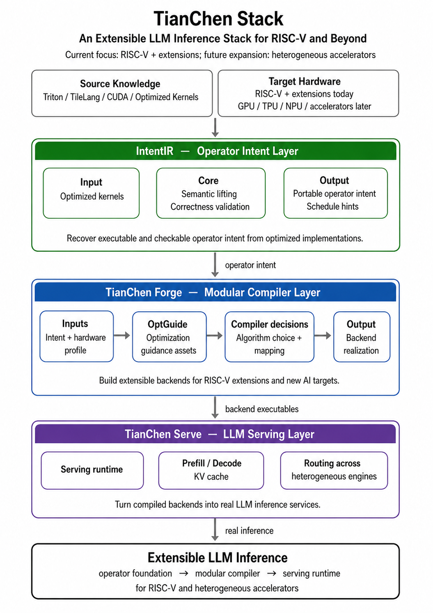

<p align="right">
  <a href="README.md">English</a> | <strong>简体中文</strong>
</p>

# TianChen Stack / 天辰软件栈

**TianChen Stack（天辰软件栈）** 是一个面向 **RISC-V 及其可扩展硬件扩展** 的大模型推理软件栈。当前重点关注 RISC-V、RVV、自定义扩展等开放异构后端，后续将逐步扩展到 GPU、TPU、NPU 和其他人工智能加速器。

这个仓库是 TianChen Stack 的总入口，用于组织三个相关项目，并提供各项目的状态说明与跳转地址：

| 层次 | 项目 | 状态 | 仓库 | 简介 |
|---|---|---:|---|---|
| 算子意图 / 前端层 | **IntentIR** | 已完成 | [gitee.com/dongshan-community/IntentIR](https://gitee.com/dongshan-community/IntentIR) | 从 Triton、TileLang、CUDA 等优化算子内核中提取可验证、可重调度的算子意图 |
| 编译器 / 后端层 | **TianChen Forge** | 进行中 | 即将开放 | 面向新后端的模块化人工智能编译器层，通过结构化优化知识和硬件能力选择算法结构与映射方式 |
| 大模型服务 / 运行时层 | **TianChen Serve** | 规划中 | 即将开放 | 面向真实大模型推理服务的运行时层，用于连接 vLLM 式服务系统与异构后端 |

---

## 项目动机

现代大模型推理系统通常依赖三类高度专业化的组件：

1. 面向特定硬件的高性能算子内核。
2. 面向特定后端的编译器规则和调度模板。
3. 面向 GPU 集群的大模型服务运行时。

这些方法在成熟 GPU 生态中非常有效，但在 RISC-V、自定义扩展、NPU、国产加速器和其他异构后端上会遇到新的问题：

- 高性能算子内核中，算子语义和硬件调度往往混在一起，难以直接复用到新后端。
- 直接让大模型生成或改写算子内核仍然容易出错，尤其在小众硬件缺少高质量训练语料时。
- 编译器优化策略经常硬编码在后端或模板中，新增硬件扩展时需要大量手工规则。
- 即使算子内核和编译器能跑起来，最终仍需要接入真实的大模型推理服务系统。

TianChen Stack 的目标是把这些隐含在实现中的知识显式化，形成一条从算子意图、编译器后端到大模型服务的可扩展软件栈路径。

---

## 总体架构

天辰软件栈按照“算子意图 -> 编译器后端 -> 推理服务”的路径组织：IntentIR 负责恢复可验证、可移植的算子意图；TianChen Forge 负责结合算子意图和结构化优化知识生成后端实现；TianChen Serve 负责把这些后端能力接入真实的大模型推理服务。

<p align="center">
  
</p>

---

## 项目一：IntentIR

**IntentIR** 是 TianChen Stack 的算子意图层。

它关注的问题是：

> 如何从已经优化过的 Triton、TileLang、CUDA 或厂商算子内核中，恢复可验证、可执行、可跨硬件重调度的算子意图？

高性能人工智能算子内核通常把两类信息混在一起：

```text
计算什么      算子的语义
如何调度      分块、向量化、线程映射、流水化
```

这种混合表示使得算子内核很难直接审计、验证和移植。IntentIR 通过结构化语义提升来解决这个问题：

- 从多种前端算子内核中提取证据。
- 使用大模型作为受约束的候选方案生成器，而不是正确性裁判。
- 通过模式检查、义务检查、源程序执行一致性检查和证明证书进行验证。
- 将算子内核表示为三层：
  - **A 层：** 算法意图
  - **B 层：** 可移植执行结构
  - **C 层：** 非绑定调度提示

### 为什么需要 IntentIR？

- 面向大模型算子内核和复杂人工智能算子设计。
- 优先保证正确性，而不是追求无约束生成。
- 让大模型处理结构化语义提升任务，而不是直接生成最终高性能内核。
- 分离算子语义和调度策略，既保留性能线索，也允许新后端重新调度。
- 不绑定某个单一前端领域专用语言（DSL），相比只依赖 Triton、TileLang 或 CUDA 的路线，更适合作为多后端抽象层。
- 适合作为 RISC-V、RVV、NPU、自定义加速器等新后端的算子库基础。

仓库：[https://gitee.com/dongshan-community/IntentIR](https://gitee.com/dongshan-community/IntentIR)

---

## 项目二：TianChen Forge

**TianChen Forge** 是 TianChen Stack 的模块化编译器层。

IntentIR 解决“算子语义如何获得”的问题，但在新硬件上，仅有算子语义还不够。编译器还需要决定：

- 使用什么算法结构？
- 如何组织分区、归约和融合？
- 中间状态应该放在哪里？
- 分块大小、向量宽度、并行轴如何选择？
- 在不同 RISC-V 扩展或人工智能加速器特性下，哪些方案合法，哪些方案更优？

TianChen Forge 的目标是让编译器不再把这些优化知识全部硬编码在后端中，而是通过结构化的 **OptGuide** 资产来指导选择。

```text
源代码 / 提供方 / 运行时证据
        ↓
OptGuide 资产
        ↓
硬件条件搜索 / 方案选择
        ↓
目标算法结构
        ↓
映射 / 中间表示 / 后端实现
```

### 为什么需要 TianChen Forge？

- 提供面向后端扩展的模块化编译器层。
- 适合 RISC-V 这类经常出现新扩展、新原子能力、新向量或矩阵特性的硬件生态。
- 将算法结构、合法性约束和映射偏好显式化。
- 减少每个后端、每个算子的手写补丁。
- 可以结合硬件画像和运行时证据，自动搜索或选择更合适的后端实现。

状态：**进行中**
仓库：**即将开放**

---

## 项目三：TianChen Serve

**TianChen Serve** 是 TianChen Stack 的大模型服务层，当前处于规划阶段。

前两个项目解决的是算子与编译器问题，而最终目标是让新后端真正进入真实的大模型推理服务。TianChen Serve 将面向 vLLM 式在线服务，关注预填充、解码、KV 缓存、批处理、路由和异构引擎接入等问题。

当前阶段，我们将它作为软件栈的第三层入口：

```text
IntentIR 提供算子意图。
TianChen Forge 构建编译器和后端支持。
TianChen Serve 将后端能力接入真实大模型推理服务。
```

状态：**规划中**
仓库：**即将开放**

---

## 天辰软件栈概览

```text
TianChen Stack
├── IntentIR
│   └── 面向优化人工智能算子内核的可验证语义提升
│
├── TianChen Forge
│   └── 由 OptGuide 驱动、面向可扩展后端的模块化编译器
│
└── TianChen Serve
    └── 面向异构后端真实大模型服务的运行时层
```

---

## 路线图

- [x] IntentIR：面向优化人工智能算子内核的可验证语义提升
- [ ] TianChen Forge：面向 RISC-V 和可扩展后端的模块化编译器层
- [ ] OptGuide：用于算法选择和映射选择的结构化优化资产
- [ ] TianChen Serve：大模型服务集成层
- [ ] RISC-V / RVV 后端案例研究
- [ ] 异构人工智能加速器支持
- [ ] 端到端大模型推理演示

---

## 许可证

本项目采用 [MIT 许可证](LICENSE)。

---

## 联系

本仓库仍在持续开发中。

IntentIR 项目见：

[https://gitee.com/dongshan-community/IntentIR](https://gitee.com/dongshan-community/IntentIR)
